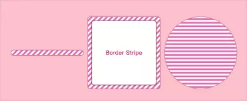

## CSS Border Stripe

> css 波动条纹



揭秘下原理：这里主要用到一个很有意思的api -> `repeating-linear-gradient`

CSS函数 `repeating-linear-gradient()` 创建一个由重复线性渐变组成的`<image>`， 这是一个类似 `linear-gradient` 的函数，并且采用相同的参数，但是它会在所有方向上重复渐变以覆盖其整个容器. 这个函数的结果是一个`<gradient>` 数据类型的对象, 这是一个特殊的`<image>`类型。

总之它实现的效果是类似于`background: url('xxx.png');`的效果，那么我们就可以绘制出条纹状的图案，之后通过`animation`动态改变`background-position`来实现波动。

```css
.progress::before {
    ...
    background: repeating-linear-gradient(
        white 0%,
        white 7.5px,
        hotpink 7.5px,
        hotpink 15px,
        white 15px,
        white 22.5px,
        hotpink 22.5px,
        hotpink 30px);
    animation: animate 20s linear infinite;
}

@keyframes animate {
    from {
        background-position: 0;
    }
    to {
        background-position: 0 450px;
    }
}

```

具体使用细节 -> [mdn文档](https://developer.mozilla.org/zh-CN/docs/Web/CSS/repeating-linear-gradient)

兼容性问题[戳这里](https://caniuse.com/#search=repeating-linear-gradient)查了下还是不错的。
