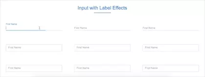

## 输入框特效




[DEMO](https://hq-lin.github.io/cool-skills/input-effects/)

* effect-1 利用兄弟选择器 `~` 将`focus`状态下的`focus-border`宽度从0变换到100%
```css
.effect-1~.focus-border {
    position: absolute;
    bottom: 0;
    left: 0;
    width: 0;
    height: 2px;
    background-color: #3399FF;
    transition: 0.4s;
}

.effect-1:focus~.focus-border {
    width: 100%;
    transition: 0.4s;
}
```

* effect-2 在effect-1基础上宽度变大的同时配合position位移达到左右展开的效果
```css
.effect-2~.focus-border {
    position: absolute;
    bottom: 0;
    left: 50%;
    width: 0;
    height: 2px;
    background-color: #3399FF;
    transition: 0.4s;
}

.effect-2:focus~.focus-border {
    width: 100%;
    transition: 0.4s;
    left: 0;
}
```

* effect-3 需要两个元素配合，用上了伪类`:before` `:after`。一个定位左边一个定位右边同时变换宽度50%
```css
.effect-3~.focus-border:before,
.effect-3~.focus-border:after {
    content: "";
    position: absolute;
    bottom: 0;
    left: 0;
    width: 0;
    height: 100%;
    background-color: #3399FF;
    transition: 0.4s;
}

.effect-3~.focus-border:after {
    left: auto;
    right: 0;
}

.effect-3:focus~.focus-border:before,
.effect-3:focus~.focus-border:after {
    width: 50%;
    transition: 0.4s;
}
```

* effect-4 只需要将`focus-border`高度从下往上展开即可

* effect-5, effect-6 只需要将`focus-border`宽度展开即可

* effect-7 需要四个元素配合，于是利用需要两个`:before`两个`:after`，处理好定位，展开原理与`effect-2`一致
```css
.effect-7:focus~.focus-border:before,
.effect-7:focus~.focus-border:after {
    left: 0;
    width: 100%;
    transition: 0.4s;
}

.effect-7:focus~.focus-border i:before,
.effect-7:focus~.focus-border i:after {
    top: 0;
    height: 100%;
    transition: 0.6s;
}
```

* effect-8 原理与`effect-7`一致只是展开方式不同

* effect-9 主要是利用了`transition-delay`设定好变换顺序
```css
.effect-9:focus~.focus-border:before,
.effect-9:focus~.focus-border:after {
    width: 100%;
    transition: 0.2s;
    transition-delay: 0.6s;
}

.effect-9:focus~.focus-border:after {
    transition-delay: 0.2s;
}

.effect-9:focus~.focus-border i:before,
.effect-9:focus~.focus-border i:after {
    height: 100%;
    transition: 0.2s;
}

.effect-9:focus~.focus-border i:after {
    transition-delay: 0.4s;
}
```

* effect-10, effect-11, effect-12, effect-13 原理很简单，高度与父容器一致通过`width`来变换

* effect-14 将两个伪元素定位到角落后同时转换`width`和`height`
```css
.effect-14:focus~.focus-bg:before {
    transition: 0.3s;
    width: 50%;
    height: 100%;
}

.effect-14:focus~.focus-bg:after {
    transition: 0.3s;
    width: 50%;
    height: 100%;
}
```

* effect-15 原理和effect-14一致，只不过定位从正中间开始变换

* effect-16 --- effect-24 主要是配合了`label`标签向上位移，并用js判断输入框有值情况下`label`保持不动。其他变换方式大同小异
